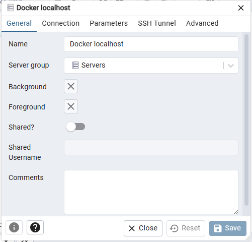
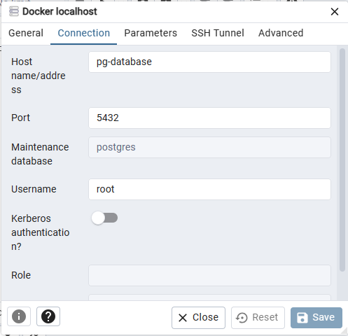

# DataEngineering

## Week 1 Info

* **pgcli** is used for accessing the database and run queris  
* **5432** is the standard port from postgres  
```docker  
pgcli -h localhost -p 5432 -u root -d ny_taxi --> connecting to db 
``` 
* to exit pgcli we can write __quit__ and press enter

#### **Docker command for setting up connections** 
```docker
    docker run -it \
    -e POSTGRES_USER="root" \
    -e POSTGRES_PASSWORD="root" \
    -e POSTGRES_DB="ny_taxi" \
    -v x:/Learnings/Data\ Engineering/DE_Zoomcamp/Week\ 1/2_DOCKER_SQL/ny_taxi_postgres_data:/var/lib/postgresql/data \
    -p 5432:5432 \
    postgres:13
```

#### **Docker command for setting up pgadmin** 

port 8080 is on the host machine and port 80 is on the container  
pgadmin is listining for request on port 80, this will mapped to host machine port 8080  
all the request that we send to port 8080 will be forwarded to port 80

```docker
    docker run -it \
    -e PGADMIN_DEFAULT_EMAIL="admin@admin.com" \
    -e PGADMIN_DEFAULT_PASSWORD="root" \
    -p 8080:80 \
    dpage/pgadmin4
``` 

To work with pgadmin we need docker network so that the database and pgadmin are in the same network and are able to see each other

    docker network create pg-network

After the network is established we run the following command after stoping the database container:-

```docker
docker run -it \
-e POSTGRES_USER="root" \
-e POSTGRES_PASSWORD="root" \
-e POSTGRES_DB="ny_taxi" \
-v x:/Learnings/Data\ Engineering/DE_Zoomcamp/Week\ 1/2_DOCKER_SQL/ny_taxi_postgres_data:/var/lib/postgresql/data \
-p 5432:5432 \
--network=pg-network \
--name pg-database \
postgres:13
```

Now we need to run PgAdmin in the same network

```docker
docker run -it \
-e PGADMIN_DEFAULT_EMAIL="admin@admin.com" \
-e PGADMIN_DEFAULT_PASSWORD="root" \
-p 8080:80 \
--network=pg-network \
--name pgadmin \
dpage/pgadmin4
```

#### **Connection on pgadmin**




#### **Describe tabel im pgcli**  
    *\d yello_taxi_data;